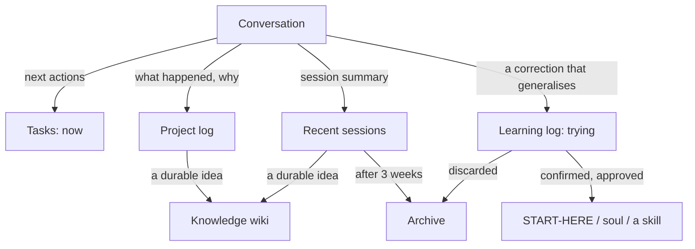

# Layers

A Coppice workspace is a stack of layers. Each layer answers one question, changes at its own speed, and lives in its own place. Most confusion about "where does this go?" comes from putting something in a layer that changes at a different speed.

You don't need every layer. Levels 0 to 3 in `docs/maturity.md` say which to add when.

## The stack

| Layer | Answers | Lives in | Changes | Read at startup? |
|---|---|---|---|---|
| **Profile** | Who is this person and how do they like to work? | `soul.md` | Quarterly | ✅ |
| **Setup** | What tools, contexts and limits apply? | `setup.md` | When tools change | ✅ |
| **Protocol** | What does the assistant do at the start and end of a session? | `START-HERE.md` | Rarely | ✅ |
| **Now** | What's live, and what's the next action on each thing? | `TASKS*.md` | Every session | ✅ (current context) |
| **Recently** | What happened in the last few weeks? | `memory/recent*.md` | Every session, trimmed weekly | ✅ (current context) |
| **Projects** | What's in flight, and what number comes next? | `memory/projects.md` | When a project starts, changes status or closes | On demand |
| **Project history** | What happened in this project, and why? | `projects/NNN-short-name/log.md` | Each session on that project, append-only | On demand |
| **Reference** | Who's who, what the jargon means, what the source documents say | `memory/glossary.md`, `memory/people/`, `context/` | Occasionally | On demand |
| **Learning** | How is the assistant's approach being adjusted? | `memory/learning-log.md` | When a pattern is noticed | On demand |
| **Knowledge** *(optional)* | What have we learned that stays true whichever project it came from? | A wiki folder, e.g. `research/wiki/` | Weekly, in small doses | On demand |
| **Automation** | What runs without being asked, and did it run? | Scheduled tasks + `memory/heartbeat.md` | When tasks are added or changed | No |
| **Archive** | What used to be current? | `memory/archive/` | Weekly, by `archive-trim` | No |

## Where does this go?

| You have… | It goes in… | Not in… |
|---|---|---|
| A new thing to do | the tasks file, as current state + `Next:` | recent sessions |
| Something you just finished | the project's `log.md`; update or remove the tasks entry | the tasks file as a "✅ done" line |
| A decision and the reason for it | the project's `log.md` | only in the conversation |
| A summary of today's session | recent sessions | the tasks file |
| A new acronym or team name | `memory/glossary.md` | `soul.md` |
| Notes on a colleague | `memory/people/name.md` | the tasks file |
| A preference about how you like to work | `soul.md`, proposed by the assistant and approved by you | the learning log (once it's confirmed) |
| A hunch about how the assistant could work better | the learning log, as `trying` | `START-HERE.md` (until it's confirmed) |
| A tool ID, file path or connector detail | `setup.md` | `soul.md` |
| A password, API key or token | the OS keychain or an uncommitted `.env`, **named** in `setup.md` | **any file in the workspace** |
| A strategy document or brief someone sent you | `context/` or the project's `inputs/` | the root |
| A draft you're working on | the project's `working/` | the root |
| A finished deliverable | the project's `outputs/` | `working/` |
| Something with no obvious home yet | the workspace's `working/`, filed at the end of the session | the root |
| An idea that will still be true in a year, whichever project it came from | the knowledge wiki, if you have one | only in a project log |
| Output from a scheduled task | `reports/` | `memory/` |
| A code repo (an app, a tool, a local server) | the project's folder; `code/<name>` if its toolchain can't handle spaces in paths (rule 26) | the root |

## How information moves

Nothing should be written in two places. Information moves *down* the stack as it settles:

Two things keep this healthy:

- **Things move on a schedule, not when someone remembers.** `archive-trim` moves old sessions; the weekly review promotes or prunes the learning log.
- **Startup reads only the top of the stack.** Everything below the line is one link away, and costs nothing until it's needed.

## Budgets

The layers read at startup have size limits, set in the `budgets` block of `setup.md` and checked by `coppice doctor`. The defaults keep the whole startup read under about 8,000 tokens. That's small enough to be fast even on a local model, and it leaves most of the context window for the actual work.
